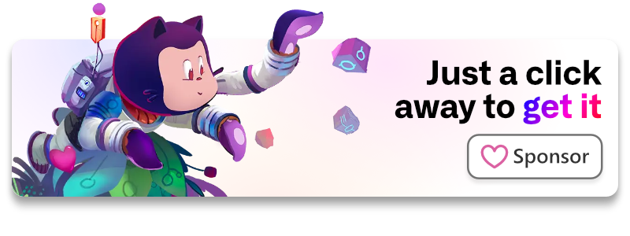

# Subscriptions

Manage subscriptions on-premises, without any payment systems!

```php
use Illuminate\Support\Facades\Auth;
use Laragear\Subscriptions\Models\Plan;

$subscription = Auth::user()->subscribeTo(Plan::find(1));

return "You are now subscribed to $subscription->name!";
```

## [Download it](https://github.com/sponsors/DarkGhostHunter/sponsorships?sponsor=DarkGhostHunter&tier_id=195145&preview=false)

[](https://github.com/sponsors/DarkGhostHunter/sponsorships?sponsor=DarkGhostHunter&tier_id=195145&preview=false)

[Become a Sponsor and get instant access to this package](https://github.com/sponsors/DarkGhostHunter/sponsorships?sponsor=DarkGhostHunter&tier_id=195145&preview=false).

## Requirements

* PHP 8.0
* Laravel 9.x

## Installation

You can install the package via Composer. Open your `composer.json` and point the location of the private repository under the `repositories` key.

```json
{
    // ...
    "repositories": [
        {
            "type": "vcs",
            "name": "laragear/subscriptions",
            "url": "https://github.com/laragear/subscriptions.git"
        }
    ],
}
```

Then call Composer to retrieve the package.

```bash
composer require laragear/subscriptions
```

You will be prompted for a personal access token. If you don't have one, follow the instructions or [create one here](https://github.com/settings/tokens/new?scopes=repo). It takes just seconds.

> **Info** 
> You can find more information about in [this article](https://darkghosthunter.medium.com/php-use-your-private-repository-in-composer-without-ssh-keys-da9541439f59).

## How this works?

Laragear's Subscriptions package uses the power of Laravel Eloquent Models with some magic to handle a small but flexible Subscription system.

The basic approach is simple: a Plan acts like a blueprint to create Subscriptions, which are marked to renew by certain intervals. A model, like your included User, can have one subscription, or even multiple subscriptions at the same time.

This enables multiple ways to handle subscriptions across your app:

- Upgrade only to a group of Plans.
- Share a subscription between multiple users.
- Lock and unlock Plans...

... and much more.

## Set up

1. Before starting, we need to install some files into your application: the migrations tables, the policies, and the plans blueprints.

```shell
php artisan subscriptions:install
```

2. If you will be subscribing only your `App\Models\User` model, and access them using `subscribers()`, you can skip this step.

Otherwise, you will need to set the name of relationship of the subscribers in the Subscription model. If you're using a monomorphic relation, use `Subscription::macroRelation()`. For polymorphic relations, use  `Subscription::macroPolymorphicRelation()`.

```php
use Laragear\Subscriptions\Models\Subscription;
use App\Models\Actor;
use App\Models\Director;

public function boot()
{
    // For a simple monomorphic relationship.
    Subscription::macroRelation('actors', Actor::class);
    
    // For all of your polymorphic relationships.
    Subscription::macroPolymorphicRelations([
        'actors' => Actor::class,
        'directors' => Director::class,
    ]); 
}
```

This way you will be able to access subscribers from a Subscription model using the relation name:

```php
use Laragear\Subscriptions\Models\Subscription;

$actors = Subscription::find('bc728326...')->actors;
```

> **Info**
> More details in the [polymorphic section](#polymorphic-relations). Don't worry, is just some paragraphs with code.

3. If you don't require any further change to the migrations files, like [adding custom columns](#custom-columns) to handle prices, or changing the foreign key to UUID, you can just migrate your database tables like it was another day in the office:

```shell
php artisan migrate
```

> **Check**
> Migrations create 3 tables: `plans`, `subscribable` and `subscriptions`.

4. Finally, add the `WithSubscriptions` trait to your models, which will enable the entity to handle subscriptions easily with just a few methods.

```php
namespace App\Models;

use Illuminate\Foundation\Auth\User as Authenticatable;
use Laragear\Subscriptions\WithSubscriptions;

class User extends Authenticatable
{
    use WithSubscriptions;

    // ...
}
```

## Plans

First, we need to create the Plans. We can go inside the `plans/plans.php` and create them using the convenient Plan builder. You're free to remove the example Plan.

```php
// plans/plans.php
<?php

use Laragear\Subscriptions\Facades\Plan;

// Plan::called('Free')->capability('coolness', 10)->monthly();
```

A Plan works like a blueprint for a Subscription, holding the information about its capabilities, limits, and other data. For example, you may create two plans for a Delivery app: one for free, and the other paid. We will differentiate them by their names and the number of deliveries per month allowed.

```php
use Laragear\Subscriptions\Facades\Plan;

Plan::called('Free')->capability('deliveries', 1)->monthly();

Plan::called('Basic')->capability('deliveries', 8)->monthly();
```

> **Warning** 
> Plans require an interval. You will get an error if the interval is not set. You can easily make lifetime plans by [renewing them automatically](#renew--extend) in your app.

Once plans are _declared_, we will need to push them into the database. For that, we can use `subscriptions:plans`. The command will read the plans and create them into the database.

```shell
php artisan subscriptions:plans

# Created 2 plans:
# - Free
# - Basic
``` 

That's it, from here you can subscribe entities to it, which can be users, companies, or whatever you want.

Before going into the subscriptions themselves, let's check how we can configure a Plan thoroughly.

### Capabilities

Capabilities are the core of Laragear's Subscriptions. Simple Plans may not need any, but complex ones may need a list of values to allow (or not) a user to do a given action.

The capabilities set in the Plan will get copied over new Subscriptions. This makes the Plan immutable, and make changes only affect new Subscriptions.

Capabilities can be set using `capability()`. For example, we will set the number of deliveries for the Basic Plan:

```php
use Laragear\Subscriptions\Facades\Plan;

Plan::called('Basic')->capability('deliveries', 8)->monthly()->save();
```

You can also set a list of capabilities in one go using an array.

```php
use Laragear\Subscriptions\Facades\Plan;

Plan::called('Basic')->capability([
    'deliveries' => 8,
    'delivery' => [
        'priority' => 'normal',
        'groceries' => false,
    ]
])  
    ->monthly()
    ->save();
```

Capabilities can be accessed using `dot.notation`. In your subscription, you can access them later with `capability()`.

```php
$priority = $user->subscription->capability('delivery.priority');
```

### Metadata

Metadata is like a note in the plan itself, which are is visible at serialization by default. This metadata replicated into the subscription itself. To attach metadata to a plan use `withMetadata()`.

```php
use Laragear\Subscriptions\Facades\Plan;

Plan::called('Free')->withMetadata([
    'payment' => 'not_allowed',
    'remember' => 'weekly',
])->monthly();
```

Metadata is just a `Collection` instance, so it's easy to retrieve and save values to it later in the Subscription.

```php
echo $subscription->metadata('payment'); // "not_allowed"
```

### Custom columns

Since the migration files are editable with new columns, you can use `withColumns()` to add primitive values to their respective columns.

```php
use Laragear\Subscriptions\Facades\Plan;

Plan::called('Basic')->withColumns([
    'price' => 29.90,
])->monthly();
```

Later, these values can be accessed like a normal property from its Subscription, as these values will be copied over them as long the column exists.

```php
echo $subscription->price; // 29.90
```

### Plan groups and levels

Plan groups allows to Subscriptions to be upgraded only to Plans of the same group, and only for "better" plans. This makes a clear path to subscription upgrades.

With `group()` and the name on the group, you can add your Plans from the most basic to the more powerful.

```php
use Laragear\Subscriptions\Facades\Plan;

Plan::group('deliveries', [
    0 => Plan::called('Free')->capability('deliveries', 1)->monthly(),
    1 => Plan::called('Basic')->capability('deliveries', 8)->monthly(),
]);
```

With that, users won't be able to downgrade to a lesser plan, or subscribe to two plans of the same group, when checking these actions with the [authorization gates](#authorization).

```php
use Laragear\Subscriptions\Models\Plan;
use Illuminate\Support\Facades\Auth;

$plan = Plan::find(2);

if (Auth::user()->cannot('upgradeTo', $plan)) {
    return "You cannot upgrade to the $plan->name.";
}

Auth::user()->upgradeTo($plan);
```

Since downgrades are disabled, you can enable them using `downgradeableGroup()` through the `Plan` Facade.

```php
use Laragear\Subscriptions\Facades\Plan;

Plan::downgradeableGroup('deliveries', [
    0 => Plan::called('Free')->capability('deliveries', 1)->monthly(),
    1 => Plan::called('Basic')->capability('deliveries', 8)->monthly(),
]);
```

> **Info**
> This doesn't remove the ability for an entity to subscribe to another Plan outside the group.

### Shareable subscriptions

Normally, a subscription would be attached to one entity, like a user or a company, but you can set a subscription to be "shareable" between multiple entities. For example, you can use this to create subscriptions for families or teams.

Use the `sharedUpTo()` to set a number of maximum entities to share the subscription.

```php
use Laragear\Subscriptions\Facades\Plan;

Plan::called('Newlyweds special')->monthly()->sharedUpTo(2);
```

An entity will be still able to be attached to another entity subscription, even if it's the same Plan and is marked as _unique_. To disable this, you may want to check if the entity already is attached to Plan before attaching it to another:

```php
use Laragear\Subscriptions\Models\Plan;
use App\Models\User;

if (User::find(1)->hasOneSubscription()) {
    return "The user cannot be attached to two or more active subscriptions.";
}

$plan = Plan::find(3);

if (User::find(2)->isSubscribedTo($plan)) {
    return "The user is already subscribed to $plan->name.";
}
```

#### Open shared subscriptions

Normally, the shared subscription slots can only be filled by the admin, but you can enable "open" subscriptions where users don't need prior approval to join in. You can easily set this using `openlySharedUpTo()`.

```php
use Laragear\Subscriptions\Facades\Plan;

Plan::called('Sunday golf')->monthly()->openlySharedUpTo(4);
```

Later, you can use the [convenient authorization gates](#authorization) to check if a user can be attached to an open or closed subscription

```php
if ($user->cant('attachTo', [$subscription, $user])) {
    return 'Only the owner of this subscription can invite you.';
}
```

The subscription can be closed or open again using `dontShareOpenly()` and `shareOpenly()`.

```php
$user->subscription->dontShareOpenly();
```

### Renewal cycle

One problem all Plans have is the renewal time. Laragear's Subscription package fixes this with a multitude of helpers to set the interval which the Plan can be renewed.

| Method            | Description                               |
|-------------------|-------------------------------------------|
| `days($amount)`   | Sets a cycle based on a number of days.   |
| `daily()`         | Sets a daily cycle.                       |
| `weeks($amount)`  | Sets a cycle based on a number of weeks.  |
| `weekly()`        | Sets a weekly cycle.                      |
| `biweekly()`      | Sets a biweekly cycle (two weeks).        |
| `months($amount)` | Sets a cycle based on a number of months. |
| `monthly()`       | Sets a monthly cycle.                     |
| `bimonthly()`     | Sets a bimonthly cycle (two months).      |
| `quarterly()`     | Sets a quarterly cycle (three months).    |
| `biannual()`      | Sets a semester cycle (six months).       |
| `yearly()`        | Sets a yearly cycle.                      |
| `biennial()`      | Sets a two-year cycle.                    |
| `triennial()`     | Sets a three-year cycle.                  |

If none of these cycles adjusts to your liking, you fine tune the interval with `every()`, which accepts an interval.

```php
use Laragear\Subscriptions\Facades\Plan;
use Carbon\CarbonInterval;

Plan::called('Special')->every(CarbonInterval::month()->addDays(5))->save();
```

> **Check**
> Monthly intervals never overflow to the next month. For example, a monthly subscription that starts 31st of January will expire at 28th/29th of February, and continue the 31st of March.

#### Not renewable plans

Plans are renewable by default, but you may want to create one-time plans with subscriptions that only last one cycle, like a "trial". For that, you can use `notRenewable()`.

```php
use Laragear\Subscriptions\Facades\Plan;

Plan::called('Basic')->monthly();

Plan::called('Trial')->weekly()->notRenewable();
```

You can also use the helpers `forOnlyOneDay()`, `forOnlyOneWeek()` and `forOnlyOneMonth()` to create not-renewable plans for one day, week or month, respectively.

```php
use Laragear\Subscriptions\Facades\Plan;

Plan::called('Trial')->forOnlyOneWeek();
```

### Plan subscribers limit

Plans can also be limited by a number of subscribers. For example, we can limit the number of subscriptions for a given Plan using `limitedTo()` and the amount of subscriptions to hold.

```php
use Laragear\Subscriptions\Facades\Plan;

Plan::called('Premium')->monthly()->limitedTo(10));
```

By default, plans will be always subscribable as long there is free slots. You can disable freeing slots with `permanentlyLimitedTo()`. Even if subscriber drops from the Plan, nobody will be able to subscribe to it once all slots were taken.

```php
use Laragear\Subscriptions\Facades\Plan;

Plan::called('Premium')->monthly()->permanentlyLimitedTo(10);
```

This makes the `subscribeTo` [authorization gate](#authorization) fail if there are no free slots.

Slots can be resized later manually in the Plan later.

```php
use Laragear\Subscriptions\Models\Plan;

$plan = Plan::find(1);

// Resize the limit of subscriptions
$plan->resizeLimit(20);

// Or remove the limits altogether.
$plan->removeLimit();
```

> **Check**
> Resizing a Plan doesn't unsubscribe users from it.

### Locking and Unlocking plans

Plans are by default open to all subscribers, but you can manually lock them using `lock()` on demand. This disables new subscriptions when using the [authorization gates](#authorization).

```php
use Laragear\Subscriptions\Models\Plan;
use Illuminate\Support\Facades\Auth;

$plan = Plan::find(1);

$plan->lock();

if (Auth::user()->cant('subscribeTo', $plan)) {
    return 'This plan has been locked for new subscribers.';
}
```

> **Check**
> Locking a plan disables new subscriptions, or subscription upgrades to it, but not renewals.

To revert the operation, use `unlock()`.

```php
use Laragear\Subscriptions\Models\Plan;

Plan::find(1)->unlock();
```

### Hidden plans

All plans are retrieved and shown publicly, but you can hide plans using `hidden()`. This sets a flag on the Plan to not be shown on queries, but still be available to be subscribed normally.

```php
use Laragear\Subscriptions\Facades\Plan;

Plan::called('Unrestricted plan')->monthly()->hidden();
```

Then, in your query, you can use `withHidden()` to include hidden plans.

```php
use Laragear\Subscriptions\Models\Plan;

$plans = Plan::withHidden()->get();
```

> **Check**
> It's not necessary to use `withHidden()` when retrieving the Plan from the subscription instance, the underlying scope is automatically removed.

### Unique plans

By default, an entity can be subscribed to multiple Plans simultaneously. For example, a user can be subscribed to a "Food deliveries" and "Groceries deliveries" at the same time. To enable _unique plans_ to only let an entity be subscribed to a single Plan across all the application, using `unique()`.

```php
use Laragear\Subscriptions\Facades\Plan;

$plan = Plan::called('Free')->monthly()->unique();
```

When checking for permissions using the [authorization gate](#authorization), the user won't be able to subscribe if the child subscription is marked as unique.

```php
use Laragear\Subscriptions\Models\Plan;
use Illuminate\Support\Facades\Auth;

$plan = Plan::find(1);

if (Auth::user()->cant('subscribeTo', $plan)) {
    return "You subscription doesn't allows to subscribe to another Plan".;
}
```

Alternatively, you may want to use [groups](#plan-groups-and-levels) to make unique plans inside given group of plans.

### Custom plans

While your plans with a set amount of capabilities may work for many subscribers, you may find your app in a position to offer "customizable" plans. You can create these like with any other plans, on demand.

For example, let's say we want to let a company create its own plan through a web interface. It's easy as just building a new plan, and attaching it immediately to the company using `createFor()`.

```php
use App\Models\Company;
use Illuminate\Http\Request;
use Laragear\Subscriptions\Facades\Plan;

public function createPlan(Request $request)
{
    $request->validate([
        // ...
    ]);
    
    $company = Company::find($request->company_id);
    
    $subscription = Plan::called("Custom Plan for $company->name")->capabilities([
        'deliveries' => 50,
        'on_weekdays' => 50,
        'priority' => 1.0,
    ])
        ->monthly()
        ->createFor($company);
    
    return 'Your are now subscribed to a custom plan for you!';
}
```

What `createFor()` does is relatively simple:

- It [hides the plan](#hidden-plans).
- It locks the plan.

You can also combine the Plan with `unique()` make the subscriber be only subscribed to that Plan only.

```php
use Laragear\Subscriptions\Facades\Plan;

$subscription = Plan::called('Custom for Company LLC.')->capabilities([
        // ...
    ])
    ->monthly()
    ->unique()
    ->createFor($company);
```

### Custom ID

Plans ID are UUID v4, and are generated automatically when these are saved into the database. This allows to hide the number of existing plans, especially when hiding them or when you create custom Plans on-demand.

You may want to change the UUID generator using the static property `Plans::$useWithUuid`, which accepts a Closure that returns a UUID.

```php
use Laragear\Subscriptions\Models\Plan;
use Ramsey\Uuid\Uuid;

Plan::$useUuid = function (Plan $plan) {
    return Uuid::uuid6();
}
```

If you want to use the [_ordered UUID_](https://laravel.com/docs/helpers#method-str-ordered-uuid) from Laravel, just call `Plans::useUuidOrdered()`.

```php
use Laragear\Subscriptions\Models\Plan;
use Laragear\Subscriptions\Models\Subscription;

Plan::useOrderedUuid();
Subscription::useOrderedUuid();
```

## Subscriptions

After your plans are set, the next step is to subscribe entities, like a user or a company. It doesn't matter which model you set to be subscribed, as this package handles subscribers as a polymorphic relationship.

### Subscribing to a Plan

The most common task is subscribing to a Plan. You can use `subscribeTo()` with the Plan instance. It returns a persisted `Subscription` model.

```php
use Laragear\Subscriptions\Models\Plan;
use Illuminate\Support\Facades\Auth;

$plan = Plan::find(3);

if (Auth::user()->cannot('subscribeTo', $plan)) {
    return "You cannot subscribe to the plan $plan->name.";
}

$subscription = Auth::user()->subscribeTo($plan);
```

You can use a second parameter to add or override custom attributes to the subscription. For example, we can add custom metadata for one subscription in particular.

```php
$subscription = $user->subscribeTo($plan, [
    'metadata' => ['is_cool' => 'true']
]);
```

Alternatively, you can use the `Subscribe` facade to attach multiple entities to one subscription. When doing this, only the first entity will be considered the _admin_.

```php
use App\Models\User;
use Laragear\Subscriptions\Models\Plan;
use Laragear\Subscriptions\Facades\Subscribe;

$plan = Plan::find(1);

$users = User::where('is_vip')->lazy();

$subscription = Subscribe::to($plan, $users, [
    'metadata' => ['is_cool' => true]
]);
```

#### Attaching data to the pivot

Behind the scenes, Laragear's Subscription package creates a pivot record called "Subscribable". This pivot allows to bind one or multiple entities to a Subscription.

When you subscribe a single model to a Plan, change it, or retrieve one from it, you can access the pivot model as `subscribable`.

```php
use Illuminate\Support\Facades\Auth;

Auth::user()->subscription->subscribable->metadata('is_cool'); // "false"
```

You may set any metadata you want for that particular subscriber at subscribing time, or even when changing it. There is no need to add `is_admin` or `metadata`, as the pivot table already comes with these columns, but, for additional columns, you will have to edit the migration.

```php
use Illuminate\Support\Facades\Auth;
use Laragear\Subscriptions\Models\Plan;

// Subscribe the user to a plan and add metadata for only him.
$subscription = Auth::user()->subscribeTo(Plan::first(), pivotAttributes: [
    'metadata' => ['is_cool' => true]
]);

$subscription->subscribable->metadata('is_cool'); // "true"
```

### Postponed start

When a subscription is created, it starts immediately. You may want to defer the start of the subscription from the plan using `postponedTo()`, which moves the subscription start forward by an amount of days or a function that should return the moment when it will start.

```php
use Laragear\Subscriptions\Facades\Plan;
use Illuminate\Support\Facades\Auth;

if (Auth::user()->cannot('subscribeTo', $plan)) {
    return "You cannot subscribe to the plan $plan->name.";
}

$subscription = Auth::user()->subscribeTo($plan)->postponedTo(function ($start) {
    return $start->addDay()->setTime(9, 0);
});

$subscription->save();
```

When the subscription is postponed, it won't be active until the date it was postponed to.

### Push cycle start

The Subscription start is set from the exact moment is created. You can "extend" the subscription cycle to accommodate a date (like, from next monday) using `pushedTo()` and the number of days, or a function that returns the date to extend to and start the cycle.

```php
use Laragear\Subscriptions\Facades\Plan;
use Illuminate\Support\Facades\Auth;

if (Auth::user()->cannot('subscribeTo', $plan)) {
    return "You cannot subscribe to the plan $plan->name.";
}

$subscription = Auth::user()->subscribeTo($plan)->pushedTo(function ($start) {
    return $start->nextMonday();
});

$subscription->save();
```

For example, if the user subscribes on Friday 24th at 9:30 AM, the subscription cycle is calculated using Monday 27th 00:00 as the starting point, but will start immediately.

> **Warning**
> If you need to postpone the subscription, ensure you postpone it _after_ pushing it further.

### Modifying the Interval

If you need to change the subscription interval to be different from the parent Plan, use `updateInterval()` with the interval you want to force into the subscription. 

```php
use Laragear\Subscriptions\Models\Plan;
use Illuminate\Support\Facades\Auth;
use Carbon\CarbonInterval;

// Subscribe the user to a monthly plan.
$subscription = Auth::user()->subscribeTo(Plan::find(1));

// Replace the monthly interval to yearly.
$subscription->updateInterval(
    CarbonInterval::create(1)
);
```

> **Warning**
> This only works with freshly created subscriptions. Forcefully changing the interval **after** the first cycle will corrupt the cycle count and start/end dates.

### Retrieving the subscription

Once a subscription is created, it can be accessed with the `subscription` property, like a normal Eloquent Relationship. This method automatically retrieves **the latest active** subscription for the entity, or returns `null` if there is none.

```php
use App\Models\User;

$user = User::find(1);

$subscription = $user->subscription;
```

For the case of users attached to multiple subscriptions, it always returns the latest subscribed from all active. You can use the ID of a subscription to retrieve it directly, as long it's active. It will also return `null` if there is no active subscription found.

```php
use App\Models\User;

$user = User::find(1);

$subscription = $user->subscription('bc728326...');
```

#### Retrieving all subscriptions

You can find all subscriptions for an entity using the `subscriptions()` relationship method. This will actually find all subscriptions, include those expired, cancelled, and future.

```php
use App\Models\User;

$user = User::find(1);

$subscriptions = $user->subscriptions()->get();
```

Since using this method alone can be a little hectic, the relation includes some useful scopes to filter the records to retrieve:

| Method           | Description                                              |
|------------------|----------------------------------------------------------|
| `active()`       | Filters for active (not expired) subscriptions.          |
| `expired()`      | Filters for expired (inactive) subscriptions.            |
| `soon()`         | Filters for subscriptions yet to start.                  |
| `cancelled()`    | Filters for subscriptions that where actively cancelled. |
| `notCancelled()` | Filters for subscriptions that where not cancelled.      |

For example, you can use the scopes to retrieve subscriptions that where cancelled and no longer active.

```php
use Laragear\Subscriptions\Models\Subscription;

$cancelled = Subscription::cancelled()->expired()->get();
```

Also, Subscriptions do have timestamps, so you can use `oldest()` to query your subscriptions like any other Eloquent Model.

```php
use Laragear\Subscriptions\Models\Subscription;

$oldestExpired = Subscription::oldest()->expired()->get();
```

### Renew / Extend

To renew a subscription for another cycle, use the `renewOnce()` method. It will extend the subscription one cycle.

```php
use Illuminate\Support\Facades\Auth;

$user = Auth::user();

echo $user->subscription->ends_at; // "2020-02-28 23:59:59"

echo $user->subscription->renewOnce()->ends_at; // "2020-03-31 23:59:59"
```

You may also extend a subscription for more than one cycle using `renewBy()` along the number of cycles.

```php
echo $user->subscription->renewBy(2)->ends_at; // "2020-04-30 23:59:59"
```

> **Warning**
> Since renewing a subscription removes the past [grace period](#grace-period), ensure you call `graceTo()` after renewing.

### Grace period

When a Subscription is not renewed, the subscription will expire at the end of the cycle. This can be relatively problematic on some scenarios, for example when you expect users to renew their subscriptions in your premises on a weekend when the store is closed. To avoid this, you can set a grace period in which the subscription will stay active even if formerly expired.

You can use `graceTo()` with the amount of days to take as a grace period, or a function that returns the time the grace period should end.

```php
use Illuminate\Support\Facades\Auth;

Auth::user()
    ->subscription
    ->renewOnce()
    ->graceTo(function ($start, $end) {
        return $end->nextFriday()->endOfDay();
    })
    ->save();
```

Then, you can check if the subscription is on grace period or not using `isOnGracePeriod()`:

```php
if ($subscription->isOnGracePeriod()) {
    return 'Your subscription already expired. Renew it to not lose access.'
}
```

> **Warning** Ensure that you use `graceTo()` after and subscription change, as changing to a new subscription, or renewing it, will invalidate the previous grace period.

### Unsubscribe / Terminate

To terminate a plan, use the `terminate()` method over it. This cancels the subscription immediately, and cuts short any grace period it may have to the moment of termination.

```php
use Laragear\Subscriptions\Facades\Plan;
use Laragear\Subscriptions\Models\Subscription;
use Illuminate\Support\Facades\Auth;

$user = Auth::user();

if ($user->cannot('terminate', $user->subscription)) {
    return "You don't have permissions to terminate this subscription.";
}

$user->subscription->terminate();

echo $user->subscription->isActive(); // false
echo $user->subscription->isCancelled(); // true
```

> **Note** 
> Terminating a Subscription doesn't detach the admin from it, but it will detach the guest. This can be disabled with `terminate(true)` over the subscription.

#### Cancellation mark

Most of the time you will want to let the subscription expire instead of cancelling it immediately. To help to detect when users don't want to automatically renew their subscriptions, use the `cancel()` method, which sets a flag on the Subscription that later you can check with `isCancelled()`.

```php
use Illuminate\Support\Facades\Auth;

$user = Auth::user();

$user->subscription->cancel()->save();

echo $user->subscription->isActive(); // true
echo $user->subscription->isCancelled(); // true
```

### Modifying the subscription

Most of the subscription data is set at a plan-level. Laragear's Subscriptions package automatically copies over the Plan blueprint into the Subscription model, which allows you to modify it for a particular subscription instead of mistakenly propagate changes to all subscriptions.

```php
$subscription->capabilities->set('deliveries', 20)->save();

echo $subscription->capability('deliveries'); // 20
echo $subscription->plan->capability('deliveries'); // 10
```

You're free to edit the Subscription as you see fit. Remember calling `save()` to push the changes into the database permanently.

### Moving the cycle start

Moving the subscription cycle start it's usually a big problem, but sometimes you will need to change it for legal reasons or because a particular demand. The way Laragear's Subscription package deals with moving the cycle start is by extending the current cycle until the new date.

You only need to use `adjustStartTo()` with a new future date. The subscription will change at the date issued.

```php
use Illuminate\Support\Facades\Auth;

$user = Auth::user();

$user->subscription->adjustStartTo(now()->day(5));

$user->subscription->save();

return 'Your subscriptions is now billed the 5th of each month.';
```

The method returns a `CarbonInterval` instance. You can use that, for example, to calculate how much to charge up-front or at the next billing date, based on the costs of the subscription.

In the following example, the user will be charged up-front for the extended date, before persisting the cycle change.

```php
use Illuminate\Support\Facades\Auth;

// Rewinds the subscription 4 days forward from now, 1st of January. 
$extended = Auth::user()->subscription->adjustStartTo(now()->day(5));

// Multiply the days extended by the cost-per-day of the monthly subscription.
$cost = $extended->totalDays * (29.90 / 30); // 3.98, if you're curious.

return "You will be charged $ {$cost} to accommodate the cycle change. Next cycle will be charged the normally.";
```

### Shared subscriptions

Normally, one entity will be tied to one subscription, but you can attach multiple entities to a subscription. You can use `attach()` over the Subscription using the entity to attach. It also accepts an optional array of attributes to set in the pivot table.

This is useful to mix with an [authorization gate](#authorization) to check if the plan allows to be shared, and there are slots free to attach the user.

```php
use App\Models\User;
use Laragear\Subscriptions\Models\Subscription;
use Illuminate\Support\Facades\Auth;

$admin = Auth::user();
$guest = User::find(4);

if ($admin->cannot('attachTo', [$admin->subscription, $guest])) {
    return 'Only admins can attach users to this subscriptions.';
}

$admin->subscription->attach($guest);
```

To remove an entity from the subscription, use `detach()` over the subscription and the entity.

```php
use App\Models\User;
use Laragear\Subscriptions\Facades\Subscription;
use Illuminate\Support\Facades\Auth;

$admin = Auth::user();
$guest = User::find(4);

$subscription = Subscription::find('bc728326...');

if ($admin->cannot('detachFrom', [$admin->subscription, $guest])) {
    return 'Only admins can attach users to this subscriptions.';
}

$admin->subscription->detach($guest);
```

### Used and unused time

You can easily get how much of the cycle has been used or remains using `used()` and `unused()`, respectively. These return a `CarbonInterval` with the difference in time.

For example, we can use the `unused()` interval to calculate an upgrade cost for other plan.

```php
$user = User::find(1);

if ($user->subscription->isFirstCycle()) {
    return 'To be eligible for a discount, you must at least pay one new cycle.';
}

$price = 49.90 - $user->subscription()->unused()->days * 29.90;

return "Upgrade now and pay a reduced price of $ $price.";
```

> **Note** Intervals for `used()` and `unused()` return empty intervals if the subscription hasn't started or already ended.

### Upgrading / Downgrading

To upgrade or downgrade a subscription, use the `changeTo()` method with the Plan you want to change to, over the entity that's subscribed.

```php
use App\Models\User;
use Laragear\Subscriptions\Models\Plan;

$user = User::find(1);

$plan = Plan::find(2);

if ($user->cant('upgradeTo', $plan)) {
    return "You cannot upgrade to the plan $plan->name";
}

$upgraded = $user->changeTo($plan);
```

> **Info** This will automatically migrate all attached entities to the new plan.

You can also change a subscription to another Plan manually using the `Change` facade.

```php
use Laragear\Subscriptions\Facades\Change;
use Laragear\Subscriptions\Models\Plan;
use Laragear\Subscriptions\Models\Subscription;

$plan = Plan::find(2);

$new = Change::to(Subscription::find('bc728326...'), $plan);
```

## Capabilities

Subscriptions and Plans contain capabilities. This is copied directly from the Plan itself, and allows checking if an entity has certain power to do in your app.

You can check capabilities using `capability()` which returns the value of the capability. It also accepts a default value to return if the capability doesn't exist.

```php
use Illuminate\Support\Facades\Auth;

$user = Auth::user();

$count = $user->deliveries()->forCurrentMonth()->count();

$max = $user->subscription->capability('deliveries', 0);

return "You have made $count deliveries out of $max for this month.";
```

You can use `capabilities` property directly to set a new value.

```php
use Illuminate\Support\Facades\Auth;

$subscription = Auth::user()->subscription;

if (Lottery::seed(300)) {
    $subscription->capabilities->set('deliveries', 20);
    $subscription->save();

    return 'You are the lucky winner! You now have 20 deliveries forever!';
}
```

You can also rewrite the capabilities entirely by setting the `capabilities` property using an array.

```php
$user->subscription->capabilities = [
    'deliveries' => 20,
    'priority' => 'low'
];

$user->subscription->save();
```

### Checking capabilities

To avoid using complex syntax, you can use convenient methods to check for the capabilities of a subscription. Use `check()` along the capability key in `dot.notation` and one of the self-explanatory methods to check if a condition is true or false.

```php
$user = Auth::user();

if ($user->subscription->hasDisabled('delivery.express')) {
    return 'Your subscription does not support Express Deliveries';
}
```

These are the following methods you can chain to a check

| Method      | Description                                      |
|-------------|--------------------------------------------------|
| hasEnabled  | Checks the capability exists and is truthy.      |
| canUse      | Checks the capability exists and is truthy.      |
| hasDisabled | Checks the capability doesn't exist or is falsy. |
| cannotUse   | Checks the capability doesn't exist or is falsy. |
| cantUse     | Checks the capability doesn't exist or is falsy. |
| isBlank     | Checks the capability value is "blank".          |
| isFilled    | Checks the capability value is "filled".         |

You can also fluently compare values using the `check()` method:

```php
$user = Auth::user();

$count = $user->deliveries()->forCurrentMonth()->count();

if ($user->subscription->check($count)->exceeds('deliveries')) {
    return 'You have depleted all your available deliveries for this month.';
}
```

| Method                              | Description                                                         |
|-------------------------------------|---------------------------------------------------------------------|
| `isGreaterThan($capability)`        | Checks if the value is greater than the named capability.           |
| `exceeds($capability)`              | Checks if the value is greater than the named capability.           |
| `isEqualOrGreaterThan($capability)` | Checks if the value is equal or greater than the named capability.  |
| `is($capability)`                   | Checks if the value is equal to the named capability, strictly.     |
| `isNot($capability)`                | Checks if the value is not equal to the named capability, strictly. |
| `isSameAs($capability)`             | Checks if the value is equal to the named capability.               |
| `isEqualOrLessThan($capability)`    | Checks if the value is equal or less than the named capability.     |
| `doesntExceeds($capability)`        | Checks if the value is equal or less than the named capability.     |
| `isLessThan($capability)`           | Checks if the value is less than the named capability.              |

## Authorization

This package includes a lot of helpers to authorize actions over Plans and Subscriptions. All of those are managed vía the `SubscriptionPolicy` and `PlanPolicy` [policy classes](https://laravel.com/docs/authorization#creating-policies) that should be already [installed](#set-up) in `app\Policies`.

| Method                               | Description                                                          |
|--------------------------------------|----------------------------------------------------------------------|
| `'subscribe', Plan::class`           | Determines that the user can subscribe to any Plan.                  |
| `'subscribeTo', $plan`               | Determines that the user can subscribe to a given Plan.              |
| `'upgradeTo', $plan`                 | Determines that the user subscription can upgrade to a given Plan.   |
| `'downgradeTo', $plan`               | Determines that the user subscription can downgrade to a given Plan. |
| `'renew', $subscription`             | Determines that the user can renew the Subscription.                 |
| `'cancel', $subscription`            | Determines that the user can cancel the Subscription.                |
| `'terminate', $subscription`         | Determines that the user can terminate the subscription.             |
| `'attachTo', $subscription, $user`   | Determines that the user can attach an user to the subscription.     |
| `'detachFrom', $subscription, $user` | Determines that the user can detach an user from the subscription.   |

This allows you to use authorization gates directly in your application, like inside controllers or views.

```blade
@can('terminate', $subscription)
    <a href="/subscription/terminate">Terminate subscription</a>
@else
    You are not allowed to terminate the subscription.
@endcan
```

You're free to change them as you see fit for your application. For example, you can add a `haveUpgradeDiscount()` gate to check if a subscription upgrade is eligible for a discount.

```php
// app\Policies\SubscriptionPolicy.php
public function haveUpgradeDiscount($user, Subscription $subscription): bool
{
    return $subscription->isActive() 
        && $subscription->isNotOnGracePeriod() 
        && $subscription->isNotFirstCycle();
}
```

Then, you can easily use the newly created gate in your application:

```blade
@can('haveUpgradeDiscount', $user->subscription)
    You're eligible for an upgrade discount of $ {{ $discount }}.
@endcan
```

## Pruning subscribers

When plans or subscription are deleted, the pivot table `subscribables` may contain dangling records. To prune them, use `subscriptions:prune`.

```shell
php artisan subscriptions:prune

# Removed 10 dangling records pointing to deleted plans or subscriptions.
```

## Events

This package fires the following self-explanatory events:

| Event                    | Description                                                   |
|--------------------------|---------------------------------------------------------------|
| `OnDemandPlanCreated`    | A new on-demand Plan was created.                             |
| `SubscriberAttached`     | An existing subscription was attached to an entity.           |
| `SubscriberDetached`     | An existing subscription was detached to an entity.           |
| `SubscriptionCancelled`  | An existing subscription was marked as cancelled.             |
| `SubscriptionChanged`    | An existing subscription was changed to another Plan.         |
| `SubscriptionCreated`    | A new subscription was created.                               |
| `SubscriptionDowngraded` | An existing subscription was replaced for a new "worse" one.  |
| `SubscriptionRenewed`    | An existing subscription was renewed for a new cycle.         |
| `SubscriptionTerminated` | An existing subscription was terminated.                      |
| `SubscriptionUpgraded`   | An existing subscription was replaced for a new "better" one. |

## Polymorphic relations

To use polymorphic relations, use the `Subscription::addPolymorphicRelations()` to add the models you plan to attach to the Subscription model. You can do this in your `AppServiceProvider`.

```php
use Laragear\Subscriptions\Models\Subscription;
use App\Models\Director;
use App\Models\Producer;
use App\Models\Actor;

public function boot()
{
    Subscription::macroPolymorphicRelations([
        'producers' => Producer::class,
        'actors' => Actor::class,
        'director' => Director::class,
    ]);
    
    // ...
}
```

Once it's done, you can easily access these polymorphic relations like you would normally do using Eloquent Models. These new methods you register will even support [eager-loading](https://laravel.com/docs/9.x/eloquent-relationships#eager-loading).

```php
use Laragear\Subscriptions\Models\Subscription;

$subscription = Subscription::with('actors')->find('bc728326...');

foreach ($subscription->actors as $actor) {
    echo $actor->name;
};
```

If you like manual control, you can also use an array with both the model class name and a callback to use as a relation accessor.

```php
use Laragear\Subscriptions\Models\Subscription;
use App\Models\Producer;
use App\Models\Actor;

public function boot()
{
    Subscription::macroPolymorphicRelations([
        'actors' => Actor::class,
        'producers' => [
            Producer::class, 
            fn() => $this->morphedByMany(Producer::class, 'subscribable')->credited()
        ];
    ]);
    
    // ...
}
```

### Retrieving polymorphic records manually

If you're using polymorphic subscribers, the default model is `App\Models\User`, so the `subscribers` property will retrieve all models for that polymorphic relation, unless you change it to other model.

```php
use Laragear\Subscriptions\Models\Subscription;

$subscription = Subscription::find('bc728326...');

$users = $subscription->subscribers;
```

When not using the default model, you will need to use the `subscribers()` with the model name or instance to retrieve the different types of subscribers.

```php
use Laragear\Subscriptions\Models\Subscription;
use App\Models\Cameraman;
use App\Models\Photographer;

$subscription = Subscription::find('bc728326...');

$cameramen = $subscription->subscribers(Cameraman::class)->get();
$photographers = $subscription->subscribers(Photographer::class)->get();
```

## Testing

This package includes a `PlanFactory` and `SubscriptionFactory`, you can easily access from their respective models.

```php
use Laragear\Subscriptions\Models\Plan;
use App\Models\User;

$plan = Plan::factory()->called('test')->monthly()->createOne();
```

For the case of the Subscription Factory, you may want to attach entities after creating them using the `attach()` method.

```php
use Laragear\Subscriptions\Models\Subscription;
use App\Models\Company;

$company = Company::find(1);

$subscription = Subscription::factory()
    ->called('test')
    ->monthly()
    ->createOne();

$subscription->attach($company);
```

## Laravel Octane compatibility

- The only singleton registered is the Plan Bag. On-demand plans removes themselves from the bag once created.
- There are no singletons using a stale config instance.
- There are no singletons using a stale request instance.
- There are no static properties written during a request.

There should be no problems using this package with Laravel Octane.

## Security

If you discover any security related issues, please email darkghosthunter@gmail.com instead of using the issue tracker.

# License

This specific package version is licensed under the terms of the [MIT License](LICENSE.md), at time of publishing.

[Laravel](https://laravel.com) is a Trademark of [Taylor Otwell](https://github.com/TaylorOtwell/). Copyright © 2011-2022 Laravel LLC.
